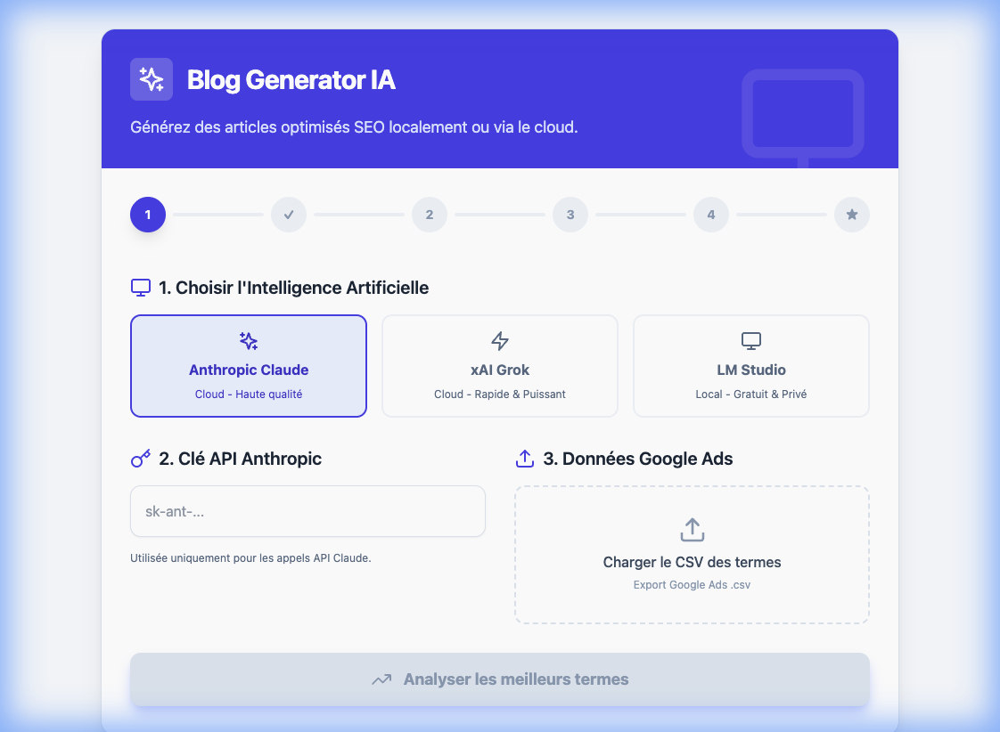

# IA Blog Generator

Un générateur d'articles de blog intelligent qui utilise soit l'API d'Anthropic (Claude 3.5), soit un modèle local via LM Studio pour créer du contenu optimisé SEO à partir de données Google Ads.



## ⚠️ État du Projet

**Attention : Cette application est actuellement en cours de développement.**

- L'intégration de **Claude (Anthropic)** et **xAI** a été implémentée mais n'a pas encore été testée de manière exhaustive dans toutes les conditions.
- L'utilisation de **LM Studio** reste la méthode recommandée pour des tests stables en local.

## ✨ Caractéristiques

- **Mode Hybride** : Utilisez la puissance du cloud (Anthropic, xAI) ou la confidentialité du local (LM Studio).
- **Optimisé SEO** : Analyse intelligente des termes de recherche Google Ads pour identifier les meilleures opportunités.
- **Apprentissage du Style** : L'IA peut apprendre de vos articles existants pour imiter votre ton et votre structure.
- **Export Markdown** : Copiez ou téléchargez vos articles directement au format `.md`.

## 🚀 Installation

1. Clonez le dépôt :
   ```bash
   git clone https://github.com/votre-compte/IA-Blog-Generator.git
   cd IA-Blog-Generator
   ```

2. Installez les dépendances :
   ```bash
   npm install
   ```

3. Lancez l'application :
   ```bash
   npm run dev
   ```

## 🛠️ Configuration

### Mode Cloud (Anthropic & xAI)
- Vous aurez besoin d'une clé API Anthropic ou xAI.
- La clé est saisie directement dans l'interface utilisateur et n'est jamais stockée sur un serveur.
- Modèles supportés : Claude 3.5 Sonnet et Grok-beta.

### Mode Local (LM Studio)
1. Téléchargez et installez [LM Studio](https://lmstudio.ai/).
2. Téléchargez un modèle (ex: Llama 3 ou Mistral).
3. Activez le "Local Server" dans LM Studio sur le port `1234`.
4. Sélectionnez le mode "LM Studio" dans l'application.

## 📄 Licence

Ce projet est sous licence MIT. Voir le fichier [LICENSE](LICENSE) pour plus de détails.
